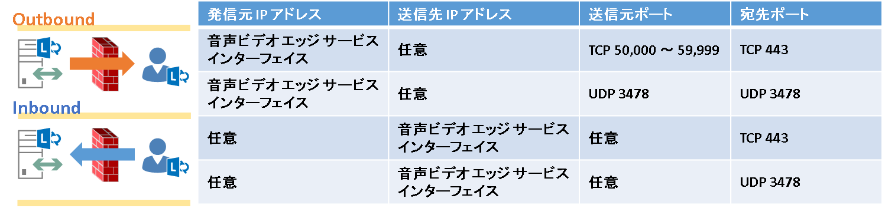
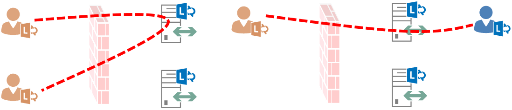

こんにちは、Unified Communications サポート チームです。   
いつも Lync/Skype for Business をご利用いただきありがとうございます。  

過去に掲載しておりましたオンプレミス サーバーの構成に関する注意事項の記事となります。
オンプレミス環境についてのお問い合わせは減少しておりますが、多くいただいた問題のため再掲させていただきます。
オンプレミス サーバーを構築いただく際に参考となれば幸いです。  

---

オンプレミスの Lync Server / Skype for Business Server を構築する際、リモート ユーザーやフェデレーション接続を実現するためには Edge Server の展開が必要になります。 今回は Edge Server を NAT で公開する際、ネットワーク装置における構成上の問題により発生する、音声やビデオ、デスクトップ共有が成立しない事象について紹介いたします。

## Edge Server に対する要件

Edge Server の展開にはネットワーク構成の要件に応じ、複数の構成が存在しますが、DMZ 内に配置して NAT により外部へ公開されるお客様が多くいらっしゃいます。 また、NAT により外部公開する場合に Edge Server を冗長化する際は DNS 負荷分散の方式が利用可能であり、TechNet の公開情報として以下にまとめられています。  
※ Lync Server 2013 の資料となりますが、最新の Skype for Business Server 2015/2019 も同様です。 

- ポートの概要  
  Lync Server 2013 における拡張統合エッジ、NAT によるプライベート IP アドレスを使用した DNS 負荷分散  
  [https://docs.microsoft.com/ja-jp/previous-versions/office/lync-server-2013/lync-server-2013-port-summary-scaled-consolidated-edge-dns-load-balancing-with-private-ip-addresses-using-nat](https://docs.microsoft.com/ja-jp/previous-versions/office/lync-server-2013/lync-server-2013-port-summary-scaled-consolidated-edge-dns-load-balancing-with-private-ip-addresses-using-nat)  

- DNS の概要  
  Lync Server 2013 での拡張統合エッジ、NAT によるプライベート IP アドレスを使用した DNS 負荷分散  
  [https://docs.microsoft.com/ja-jp/previous-versions/office/lync-server-2013/lync-server-2013-dns-summary-scaled-consolidated-edge-dns-load-balancing-with-private-ip-addresses-using-nat](https://docs.microsoft.com/ja-jp/previous-versions/office/lync-server-2013/lync-server-2013-dns-summary-scaled-consolidated-edge-dns-load-balancing-with-private-ip-addresses-using-nat)  

また、本記事の内容に関連する音声・ビデオに対するポート要件については以下に記載されています。

- Lync Server 2013 の外部の音声ビデオ ファイアウォールおよびポートの要件を決定する  
  [https://docs.microsoft.com/ja-jp/previous-versions/office/lync-server-2013/lync-server-2013-determine-external-a-v-firewall-and-port-requirements](https://docs.microsoft.com/ja-jp/previous-versions/office/lync-server-2013/lync-server-2013-determine-external-a-v-firewall-and-port-requirements)  

要点をまとめさせていただくと、重要なポイントは以下のとおりとなります。  

- ネットワーク構成
  - 内部インターフェイスには内部ネットワークと接続可能なアドレスを設定し、ディフォルトルートを定義しません。
  - 内部ネットワーク向けにはスタティック ルートを設定します。
  - 外部インターフェイスには内部とは接続できない NAT 後のアドレスを設定し、ディフォルトルートを定義します。
  - 公開用のグローバル アドレスとは、各サービスごとに 1 対 1 のスタティック NAT とする必要があります。
  - DNS サーバーは外部、もしくは DMZ 上のものを指定します。
  - 社内のサーバーやプール名については、通常は hosts ファイルで定義して対応します。
  

- ポート要件
  - 現実装においては、音声ビデオ エッジ サービスに対して開放が必要なポートは TCP 443 / UDP 3478 のみとなります。
  - OCS 2007 R2 以降においては、これらの 2 ポートのみでメディア トラフィックを接続可能とする実装が追加されたためです。
  - TCP/UDP 50,000 ～ 59,999 のポート開放が必要なケースは、OCS 2007 との相互接続が必要な場合だけとなります。
  

## NAT に対する要件

NAT で Edge Server を公開する場合、AV エッジ サービスに対する NAT には次の要件が求められます。  

1. アドレスの変換が行われる際、マスカレードをはじめポート番号が変換される NAT はサポートされません。
1. インバウンド時にソース アドレスが変換されることは許されません。 (STUN が適切に機能しません)
1. アウトバウンド時にエッジ サーバーのソース ソースアドレスは必ずグローバル アドレスに変換される必要があります。

特定の構成に対して 3. の要件が満たされない結果、メディア ストリームが正常に接続できない問題が発生します。 これは NAT 装置が Edge Server に対する要件を満たせないことが要因であり、Lync/Skype for Business 側では根本的な解決が提供できない問題となるため、導入前の製品選定段階で要件が満たせるか十分に確認いただく必要があります。 通称としてヘアピン問題とされている事象について、その詳細を次で説明いたします。  

## Edge 間リレーとヘアピン接続

TCP 443 や UDP 3478 によるリレー接続において、外部ユーザーは音声ビデオ エッジ サービスの FQDN を用いて接続し、内部ユーザーは Edge Server の Pool FQDN を用いて接続します。 そのため、各クライアントが同じ Edge Server を選択した場合は 1 台の Edge Server のみを経由してリレーすることとなります。 しかしながら、各クライアントがそれぞれ別の Edge Server を選択した場合は、2 台の Edge Server 間でトラフィックがリレーされる必要があります。  

- クライアントが同じ Edge Server を選択したケース
  
  ※ 1 台の Edge Server のみ利用しいてリレー接続されます。

- クライアントがそれぞれ異なる Edge Server を選択したケース
  
  ※ 2 台の Edge Server 間をまたいで接続する通信が発生します。

Edge Server 間でリレー接続が行われる場合、DMZ 上のプライベート アドレス間で通信が行われない点に注意が必要です。 パケットはトッポロジで定義された音声ビデオ エッジ サービスのグローバル アドレス宛に相互に送信され、受信時もグローバル アドレスを送信元としてパケットが到着することを期待します。 NAT の動作もふまえてパケットのフローを見ると、Edge Server 間の通信が一旦 NAT 装置を介して接続される上図に示されるとおり、この様なケースはヘアピン接続と呼ばれています。 ヘアピン接続となった際、NAT によりアドレスがどの様に変換されるか詳細に記載した図が以下となります。  

- ヘアピン接続時の適切な NAT 動作
  

外部クライアントと Edge Server 間の接続だけを見ると、上記で示した NAT に対する要件は一般的なものであり実現可能となります。 しかしながら、Edge Server 間の通信に対しても同様に必須として検討すると、NAT 装置の構成や種類によっては実現できないケースも存在します。 図に示すように NAT 装置が Edge Server ごとの存在すれば、ネットワークのルーティングに従ってグローバル アドレス宛のパケットは物理的にインターネット側を経由することになるため、NAT の動作も個々の設定に従って想定通りに機能します。 しかしながら、1 台の NAT 装置で 2 台分の Edge Server に対する NAT を構成する場合、ヘアピン接続と NAT の要件を 1 台の NAT 装置内で論理的な処理で実現する必要があり、この点について実装上実現できない NAT 装置が存在します。 具体的には、内部ネットワークから受信した、NAT 装置自身がテーブルを持つグローバル アドレス宛のパケットが適切に転送できなかったり、内部ネットワークから内部ネットワークへおり返されるパケットに対して送信元アドレスをグローバルに変換できない、といった事象が確認されております。  

- 宛先や送信元のアドレスが適切に変換されないケース
  

## 推奨されない回避策

OCS 2007 R2 以降で実装された TCP 443 / UDP 3478 によるリレー接続は、クライアント側のネットワークにおいて Proxy Server が介在するなどの理由により TCP 443 以外のトラフィック (TCP/UDP 50,000-59,999） が疎通できないケースが増えたことより追加された実装となります。 また、セキュリティの観点より開放するポートを限定することが望まれる状況から、この追加実装もふまえて必須ポートは TCP 443 / UDP 3478 のみとしております。 しかしながら、ポート要件にも記載がある通り、OCS 2007 との下位互換を維持するために TCP/UDP 50,000-59,999 を開放することで古い方式による接続についても利用可能な実装となっています。  

TCP 443 / UDP 3478 による新しい方式においては説明いたしましたとおり、音声ビデオ エッジ サービスの FQDN に対して接続を実施するため、DNS の名前解決により選択された Edge Server が利用され続けます。この結果、今回紹介させていただいた事象が発生いたしますが、TCP/UDP 50,000-59,999 を用いる実装では内部ユーザーが選択した Edge Server が ICE のメディア ネゴシエーションにより選択される動作となります。 そのため、下図の様に NAT 装置が要件を満たせなかったとしても事象の発生を回避することが可能となります。  

- TCP/UDP 50,000-59,999 を用いて回避される状況
  

しかしながら、外部クライアント側のネットワークに依存し、結果的に TCP 443 / UDP 3478 による接続しか行えない場合には事象が発生することとなります。 外部クライアント側のネットワーク要件を規定することはできず、すべてのケースに対応可能な回避策にはならないため弊社としては推奨できない回避策となります。 NAT 装置側で要件を満たしていただく、もしくは要件を満たせる NAT 装置に変更いただくことが根本的な解決策となり、事象の発生を回避するために推奨される唯一の手段となります。 従いまして、この要件を十分にご理解いただき、ネットワーク装置の製品選定段階で対応可能なものであるか、入念に検討いただくことをお願いいたします。  

